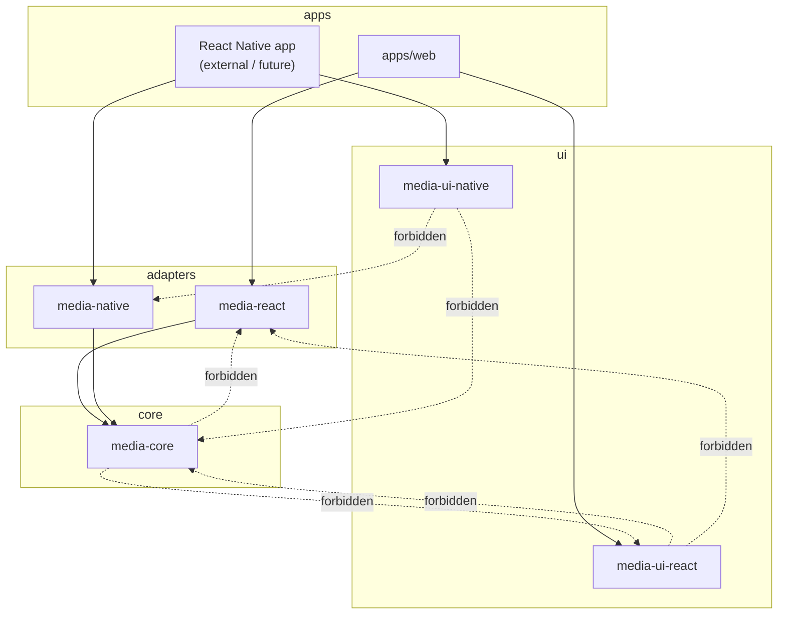
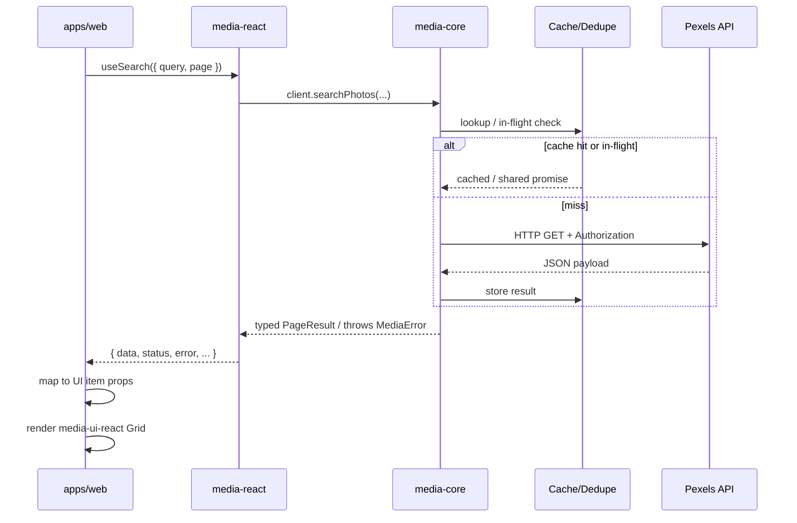
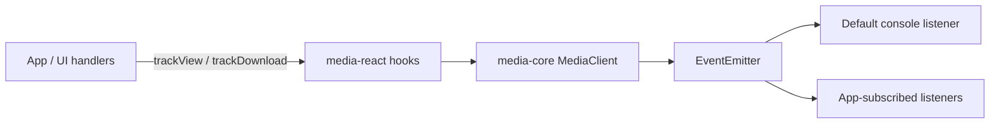
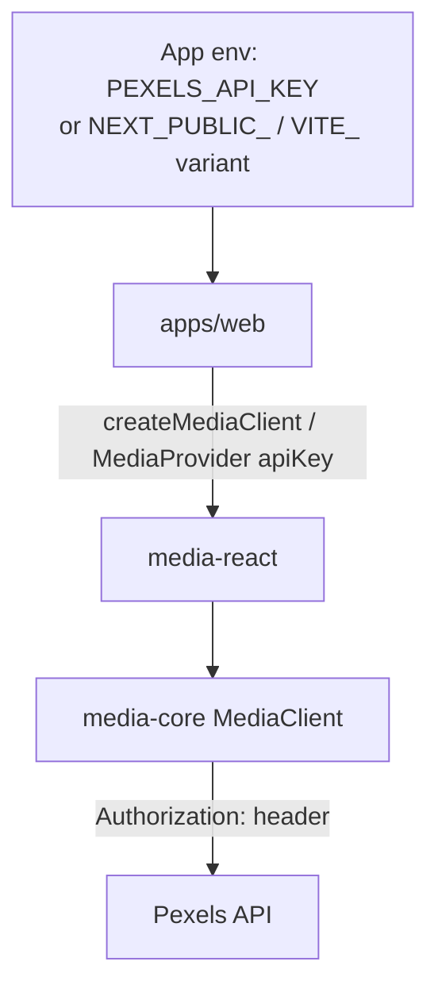
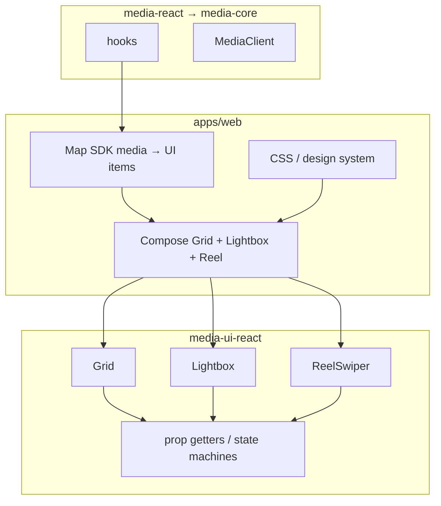

# Architecture

> **Status:** Planned specification. No packages or application code have been implemented yet.

## System overview

MediaForge is a layered monorepo that separates:

1. **Core SDK** (`media-core`) — platform-agnostic Pexels client, caching, pagination, typed errors, and events.
2. **Framework adapters** (`media-react`, `media-native`) — providers and hooks that bind the core client to React / React Native lifecycles.
3. **Headless UI** (`media-ui-react`, `media-ui-native`) — behavior-only Grid, Lightbox, and Reel Swiper components with no knowledge of data fetching.
4. **Applications** (`apps/web`, future RN apps) — compose adapters + UI, own styling, auth configuration, and product UX.

The design goal is portability: the same core SDK powers web and native; UI packages remain replaceable and style-agnostic.

---

## Package responsibilities

| Package | Owns | Does not own |
| --- | --- | --- |
| `media-core` | Pexels HTTP, API key config, cache/dedupe, pagination helpers, typed responses/errors, event bus | React, DOM, RN, styling, UI |
| `media-react` | `MediaProvider`, hooks (`useSearch`, `useCurated`, `useMediaItem`, `useMediaEvents`, …) | Visual components, CSS, Pexels HTTP internals (delegates to core) |
| `media-native` | RN provider + hooks mirroring `media-react` | Native UI primitives styling, DOM APIs |
| `media-ui-react` | Headless Grid / Lightbox / Reel Swiper (prop getters, a11y, keyboard) | Fetching, Pexels types, API keys |
| `media-ui-native` | Same headless behaviors for RN | Fetching, Pexels types, API keys |
| `apps/web` | Composition, styling, env wiring, demo flows | Reimplementing SDK internals |

---

## Dependency graph



### Planned package layout

```
packages/
  media-core/
  media-react/
  media-native/
  media-ui-react/
  media-ui-native/
apps/
  web/
```

---

## Allowed and forbidden dependencies

### Allowed

| Package | May depend on |
| --- | --- |
| `media-core` | Pure TS utilities only (e.g. fetch polyfill types if needed). No UI. |
| `media-react` | `media-core`, `react` |
| `media-native` | `media-core`, `react`, `react-native` |
| `media-ui-react` | `react`, `react-dom` (for portal/focus as needed) |
| `media-ui-native` | `react`, `react-native` |
| `apps/web` | `media-react`, `media-ui-react`, app framework (e.g. Vite/Next), styling tools |

### Forbidden

| Rule | Rationale |
| --- | --- |
| `media-core` → React / RN / DOM / UI packages | Keeps core portable and testable in Node |
| `media-ui-react` → `media-core` or `media-react` | UI stays headless and reusable with any data source |
| `media-ui-native` → `media-core` or `media-native` | Same as above for native |
| UI packages imposing design tokens / CSS frameworks as hard deps | Application owns presentation |
| Circular dependencies across packages | Enforced by workspace tooling (planned) |

Architectural boundary tests (see [TESTING.md](./TESTING.md)) will assert these rules.

---

## Data flow



**Composition rule:** UI packages receive plain props (`items`, `onSelect`, etc.). They never call the SDK.

---

## Event flow

`media-core` owns a small event bus for analytics-style media interactions.



Planned event types:

- `media:view` — item entered viewport / opened in lightbox / reel focus
- `media:download` — user initiated download / open original

Subscribe / unsubscribe APIs live on the client. A default console listener is registered unless disabled via configuration.

See [API_CONTRACTS.md](./API_CONTRACTS.md) and [SDK_DESIGN.md](./SDK_DESIGN.md).

---

## Authentication flow



- The API key is configured once at client construction (or via provider props).
- `media-core` attaches the key to outbound requests; it does not read `process.env` itself when running in the browser (the app supplies the key).
- Browser exposure of keys is a known limitation; see [SECURITY.md](./SECURITY.md).

---

## Headless UI architecture



Principles:

- Components expose **state + prop getters** (or render props / headless hooks), not styled markup.
- No hard dependency on Tailwind, CSS-in-JS, or theme packages inside UI libraries.
- Accessibility (roles, keyboard, focus trap) is part of behavior, not styling.

---

## Architectural principles

1. **Separation of concerns** — data, framework binding, and presentation are independent packages.
2. **Dependency direction** — dependencies point inward toward `media-core`; UI never pulls data packages.
3. **Headless by default** — UI ships behavior; apps ship look-and-feel.
4. **Typed contracts first** — public TypeScript types are the source of truth (see [API_CONTRACTS.md](./API_CONTRACTS.md)).
5. **Portability** — `media-core` runs anywhere `fetch` is available.
6. **Observability via events** — view/download tracking is explicit and pluggable.
7. **Fail loudly with typed errors** — callers discriminate error kinds instead of parsing strings.
8. **Cache and dedupe at the core** — adapters stay thin.

---

## Planned demo application composition

`apps/web` will:

1. Mount `MediaProvider` with API key from environment.
2. Drive search + pagination via hooks.
3. Render results with `Grid` from `media-ui-react`, styled by the app.
4. Open selected items in `Lightbox`.
5. For video-centric results, compose `ReelSwiper`.
6. Subscribe to media events for logging / analytics demonstration.

---

## Related documents

- [SDK_DESIGN.md](./SDK_DESIGN.md) — client internals
- [UI_COMPONENTS.md](./UI_COMPONENTS.md) — component specs
- [API_CONTRACTS.md](./API_CONTRACTS.md) — TypeScript surfaces
- [SECURITY.md](./SECURITY.md) — auth and threat model
- [SCOPE_AND_DECISIONS.md](./SCOPE_AND_DECISIONS.md) — trade-offs
