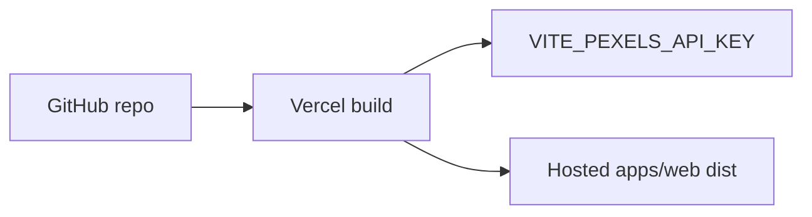

# Deployment

> **Status:** Local web app is implemented. Hosted deployment remains pending.

## Local development

### Prerequisites

- Node.js 18+
- pnpm 9+
- Pexels API key

### Install and run

```bash
pnpm install
cp apps/web/.env.example apps/web/.env
```

Set `VITE_PEXELS_API_KEY` in `apps/web/.env`, then:

```bash
pnpm dev
```

App URL: `http://localhost:5173`

### Workspace commands

```bash
pnpm typecheck
pnpm lint
pnpm test
pnpm build
```

Package filter examples:

```bash
pnpm --filter @mediaforge/web dev
pnpm --filter @mediaforge/web build
pnpm --filter @mediaforge/core test
```

### Repository layout

```text
apps/web
packages/media-core
packages/media-react
packages/media-native
packages/media-ui-react
packages/media-ui-native
```

---

## Environment variables

| Variable | Scope | Notes |
| --- | --- | --- |
| `VITE_PEXELS_API_KEY` | `apps/web` | Required for the demo app; visible in the browser bundle |
| `PEXELS_API_KEY` | Future BFF/proxy | Preferred for production |

Rules:

- Real `.env` files are gitignored
- Commit only `.env.example` placeholders
- Never log the key

See [SECURITY.md](./SECURITY.md).

---

## Builds

| Target | Output |
| --- | --- |
| `@mediaforge/core` | `packages/media-core/dist` |
| `@mediaforge/react` | `packages/media-react/dist` |
| `@mediaforge/native` | `packages/media-native/dist` |
| `@mediaforge/ui-react` | `packages/media-ui-react/dist` |
| `@mediaforge/ui-native` | `packages/media-ui-native/dist` |
| `@mediaforge/web` | `apps/web/dist` (Vite static build) |

---

## Vercel deployment (prepared, not deployed in this phase)

Recommended Vercel project settings for the monorepo:

| Setting | Value |
| --- | --- |
| Framework preset | Vite |
| Root directory | `apps/web` |
| Install command | `pnpm install` from repo root (enable monorepo / include root) |
| Build command | `pnpm --filter @mediaforge/web build` from repo root |
| Output directory | `apps/web/dist` |
| Env var | `VITE_PEXELS_API_KEY` |

Notes:

- Build must be able to resolve workspace packages (`@mediaforge/react`, `@mediaforge/ui-react`, and transitive `@mediaforge/core`)
- Prefer installing from the repository root so pnpm workspaces link correctly
- Do not commit secrets
- Production should eventually proxy Pexels instead of exposing a browser key



---

## SDK / component docs sites

Still planned:

- TypeDoc or VitePress for SDK docs
- Storybook / MDX for headless UI recipes

README links remain `_TBD_` until published.

---

## Related documents

- [SECURITY.md](./SECURITY.md)
- [ARCHITECTURE.md](./ARCHITECTURE.md)
- [apps/web/README.md](../apps/web/README.md)
