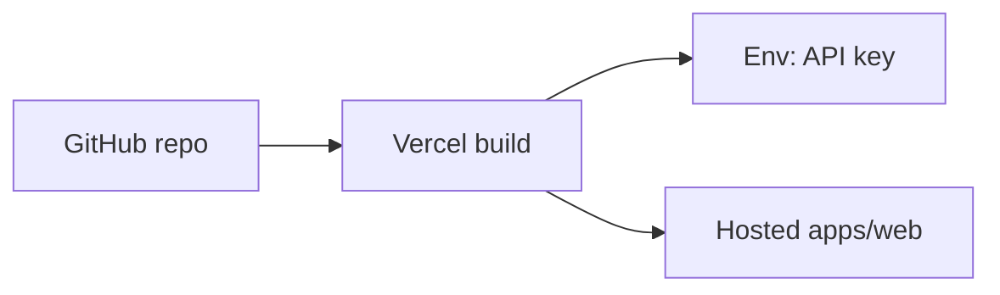

# Deployment

> **Status:** Planned deployment and local development workflow. Packages and apps are not implemented yet.

## Local development (planned)

### Prerequisites

- Node.js LTS
- Package manager decided at implementation (npm / pnpm / yarn — prefer one lockfile)
- Pexels API key from the Pexels developer portal

### Planned workspace commands

Exact scripts will be added with the monorepo tooling. Expected shape:

```bash
# install
pnpm install

# develop web demo
pnpm --filter web dev

# build all packages
pnpm -r build

# test
pnpm -r test

# typecheck
pnpm -r typecheck
```

### Repository layout (planned)

```
apps/web                 # demo application
packages/media-core
packages/media-react
packages/media-native
packages/media-ui-react
packages/media-ui-native
```

Internal packages are consumed via workspace protocol during development.

---

## Environment variables

| Variable | Required for | Notes |
| --- | --- | --- |
| `PEXELS_API_KEY` | Server proxy (if used) | Secret; never commit |
| `VITE_PEXELS_API_KEY` or `NEXT_PUBLIC_PEXELS_API_KEY` | Client demo | Visible in browser; demo-only |

Setup (planned):

1. Copy `.env.example` → `.env.local` (or `.env`).
2. Paste the Pexels key.
3. Start the web app.

See [SECURITY.md](./SECURITY.md) for client-side key limitations.

---

## Builds

| Target | Output (planned) |
| --- | --- |
| `media-core` | ESM/CJS + `.d.ts` |
| `media-react` | ESM/CJS + `.d.ts` |
| `media-native` | ESM/CJS + `.d.ts` |
| `media-ui-react` | ESM/CJS + `.d.ts` |
| `media-ui-native` | ESM/CJS + `.d.ts` |
| `apps/web` | Static or SSR build for hosting |

Libraries should be bundler-friendly (externalize `react` / `react-native`).

---

## Vercel deployment (planned)

The demo web app is intended to deploy to Vercel.

### Steps (planned)

1. Connect the GitHub repository to Vercel.
2. Set the project root / monorepo filter for `apps/web`.
3. Configure env vars in the Vercel dashboard (`PEXELS_API_KEY` or public variant used by the app).
4. Build command and output directory follow the chosen app framework (Vite `dist`, Next `.next`, etc.).
5. Confirm preview deployments work on PRs.

### Notes

- Do not embed keys in Vercel build logs intentionally.
- Production should prefer a server proxy when moving beyond the take-home demo.
- README live application link remains `_TBD_` until a deployment exists.



---

## SDK documentation (planned)

Options when implementation lands:

- TypeDoc / API Extractor generated from `media-core` and `media-react` exports
- Or a small docs site (e.g. VitePress) describing install + usage

Hosted URL will be linked from the root README when available (currently `_TBD_`).

Minimum content:

- Installation
- `createMediaClient` / `MediaProvider`
- Search + pagination examples
- Events
- Error handling
- Package boundary rules

---

## Component documentation (planned)

Options:

- Storybook for `media-ui-react` (unstyled recipes + a11y notes)
- Or MDX examples showing prop getters + app-provided CSS

Hosted URL remains `_TBD_` until published.

Minimum stories/examples:

- Grid with selection
- Lightbox open/close / keyboard
- Reel Swiper active slide
- Correct vs incorrect composition with data hooks (link to skills)

---

## CI (planned, optional under time constraints)

- Install, typecheck, unit tests, boundary checks on PR
- Preview deploy via Vercel

---

## Related documents

- [SECURITY.md](./SECURITY.md)
- [ARCHITECTURE.md](./ARCHITECTURE.md)
- [AI_USAGE.md](./AI_USAGE.md)
