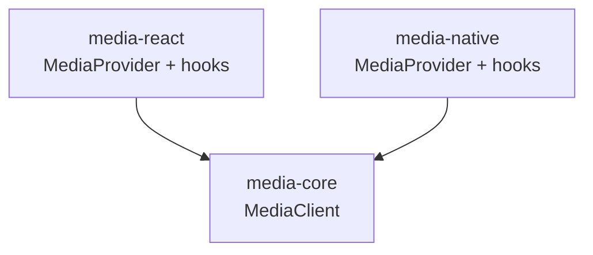

# SDK Design

> **Status:** Planned design for `media-core`, `media-react`, and `media-native`. Not implemented yet.

## Goals

- Portable TypeScript client for Pexels media.
- Zero dependency on React, React Native, or DOM inside `media-core`.
- Predictable caching and in-flight request deduplication.
- Typed responses and typed errors.
- Pluggable events for view / download tracking.
- Thin framework adapters that only manage lifecycle and React state.

---

## MediaClient

`MediaClient` is the primary entry point of `media-core`.

### Construction (planned)

```ts
function createMediaClient(config: MediaClientConfig): MediaClient;
```

Responsibilities:

| Concern | Behavior |
| --- | --- |
| Configuration | Validates `apiKey` presence; applies defaults for `baseUrl`, `perPage`, cache, dedupe |
| Resource methods | Search, curated/trending, get-by-id |
| HTTP | Performs fetch, maps status codes → `MediaError` |
| Cache | Optional TTL LRU (or simple Map) keyed by normalized request |
| Dedupe | Coalesces identical in-flight promises |
| Events | Emit / subscribe / default console listener |
| Portability | Uses injected `fetch` when provided |

The client is **stateless regarding UI** and **stateful regarding cache + listeners**.

---

## HTTP layer

### Planned design

```
MediaClient method
  → normalize params
  → build URL + query string
  → cache key
  → dedupe / cache lookup
  → http.request(path, init)
  → parse JSON
  → map to Photo / Video / PageResult
  → store cache
  → return
```

### Requirements

- Prefer native `fetch` (browser / RN / Node 18+).
- Inject `fetch` for tests and custom proxies.
- Support optional `baseUrl` override (Pexels default vs app BFF).
- Set `Authorization` from config; never log it.
- Timeouts via `AbortController` (planned optional `timeoutMs`).
- Map non-2xx to typed `MediaError` with `status` and `code`.
- Treat invalid JSON as `PARSE`.

### Planned endpoint mapping

Aligned with current Pexels REST API at implementation time (verify against official docs):

| Method | Endpoint (illustrative) |
| --- | --- |
| `searchPhotos` | `GET /v1/search` |
| `curatedPhotos` | `GET /v1/curated` |
| `getPhoto` | `GET /v1/photos/:id` |
| `searchVideos` | `GET /videos/search` |
| `popularVideos` | `GET /videos/popular` |
| `getVideo` | `GET /videos/videos/:id` |

Response mappers convert Pexels JSON into the contracts in [API_CONTRACTS.md](./API_CONTRACTS.md). Mapping is isolated so Pexels field drift does not leak into apps.

---

## Authentication

- API key is required at construction (unless a custom `baseUrl` proxy that ignores client keys is used—still pass a placeholder or dedicated proxy mode if needed).
- Key is read-only on the instance.
- `media-core` does not load env vars automatically; the host app passes the key. This keeps core environment-agnostic and avoids accidental bundling assumptions.

See [SECURITY.md](./SECURITY.md).

---

## Caching

### Planned policy

| Setting | Default (planned) |
| --- | --- |
| Enabled | `true` |
| TTL | e.g. 60_000 ms |
| Max entries | e.g. 100 |
| Key | `method + normalized query string` |

Rules:

- Cache successful `PageResult` and single-item responses only.
- Do not cache error responses (or cache only short-circuit 404s if explicitly decided later).
- `clearCache()` wipes all entries.
- `cache: false` disables storage (dedupe may still apply).

Cache is in-memory only for v1. Persistent cache is a future improvement.

---

## Request deduplication

When `dedupe: true` (planned default):

1. Compute the same cache key used for caching.
2. If a promise for that key is in-flight, return it to all callers.
3. On settle, remove from the in-flight map.
4. On success, write through to the result cache.

This prevents duplicate network calls from React Strict Mode double-effects and parallel hook usage with identical params.

---

## Pagination

- Page-based (`page`, `perPage`).
- `PageResult.pageInfo` exposes `nextPage` / `prevPage` helpers derived from `page`, `perPage`, and `totalResults` when available.
- Adapters expose `nextPage` / `prevPage` / `setPage` on search hooks.
- Core does not auto-fetch entire result sets; callers page explicitly.

Edge cases:

- Empty query → `BAD_REQUEST` or no-op at adapter layer (`params: null`).
- `page < 1` normalized or rejected.
- Exhausted pages → empty `items`, `nextPage: null`.

---

## Events

### Bus

Simple typed pub/sub inside the client:

- `on` / `off` / `emit`
- `trackView` / `trackDownload` as ergonomic wrappers

### Default console listener

Unless disabled:

```ts
// planned behavior
client.on('*', (event) => {
  console.info('[media-core]', event.type, event.payload);
});
```

Exact wildcard vs per-type registration is an implementation detail; public API guarantees view/download can be subscribed.

### Who emits?

- Core methods do **not** automatically emit view/download on fetch.
- Apps / UI composition call `trackView` / `trackDownload` when UX events occur (lightbox open, reel active slide, download click).
- `media-react` exposes `useMediaEvents()` for ergonomic access.

---

## Errors

All failures surface as `MediaError`:

| HTTP / condition | Code |
| --- | --- |
| 401 | `UNAUTHORIZED` |
| 403 | `FORBIDDEN` |
| 404 | `NOT_FOUND` |
| 429 | `RATE_LIMITED` |
| 400 | `BAD_REQUEST` |
| Network failure | `NETWORK` |
| Abort / timeout | `TIMEOUT` |
| JSON parse | `PARSE` |
| Other | `UNKNOWN` |

`retriable` hints: `RATE_LIMITED`, `NETWORK`, `TIMEOUT` → true; auth/not found → false.

Adapters should set hook `error` to this object without wrapping away the `code`.

---

## Portability

`media-core` constraints:

- TypeScript targeting a modern ES baseline.
- No `window`, `document`, `localStorage`.
- No React imports.
- No React Native imports.
- Testable under Node with a mock `fetch`.

`media-react` / `media-native`:

- Create or accept a `MediaClient`.
- Hold it in context.
- Mirror hook APIs so apps can share mental models across platforms.



---

## Adapter design (`media-react` / `media-native`)

Planned responsibilities only:

1. Provide context with a stable client instance.
2. Translate async client calls into hook state (`status`, `data`, `error`).
3. Re-run on param changes; respect `null` params as disabled.
4. Expose pagination controls.
5. Bridge events.

Adapters must not:

- Own HTTP
- Own cache policy beyond passing config through
- Render UI
- Import UI packages

---

## Testing hooks for the SDK

- Inject mock `fetch`.
- Disable cache/dedupe for isolated tests.
- Assert mapper output snapshots.
- Assert dedupe: N parallel identical calls → 1 network.

Details in [TESTING.md](./TESTING.md).

---

## Related documents

- [API_CONTRACTS.md](./API_CONTRACTS.md)
- [ARCHITECTURE.md](./ARCHITECTURE.md)
- [SECURITY.md](./SECURITY.md)
