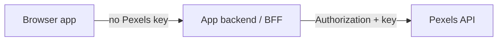

# Security

> **Status:** Policy in force for `@mediaforge/core`. Remaining packages must follow the same rules when implemented.

## API key handling

MediaForge talks to the [Pexels API](https://www.pexels.com/api/), which authenticates via an API key sent on each request.

**Planned rules**

- The key is supplied by the application when constructing `MediaClient` / mounting `MediaProvider`.
- `media-core` stores the key only in memory on the client instance.
- The key must never be hardcoded in source, committed, or published in docs examples as a real secret.
- Example env files use placeholders only (e.g. `PEXELS_API_KEY=`).

**Planned request shape**

```http
Authorization: <PEXELS_API_KEY>
```

(Exact header format follows Pexels’ current docs at implementation time.)

---

## Environment variables

| Variable (planned) | Scope | Purpose |
| --- | --- | --- |
| `PEXELS_API_KEY` | Server / local secret | Preferred when a server proxy is used |
| `VITE_PEXELS_API_KEY` or `NEXT_PUBLIC_PEXELS_API_KEY` | Client bundle | Demo-only direct browser calls |

Rules:

- Real `.env` files are gitignored (see root `.gitignore`).
- A committed `.env.example` lists names without values.
- CI/CD and Vercel store secrets in the platform secret store, not in repo files.

---

## Browser / client-side API key limitations

**Important limitation:** Any key shipped to the browser is visible to end users (network tab, bundle inspection).

For this take-home demo it may be acceptable to use a **restricted / rate-limited Pexels key** in the client for simplicity. This is an intentional trade-off documented in [SCOPE_AND_DECISIONS.md](./SCOPE_AND_DECISIONS.md).

**Production recommendation (not required for the demo):**



- Browser calls same-origin `/api/media/*`.
- Server holds `PEXELS_API_KEY`.
- Optional: per-user rate limits, referrer checks, auth.

`media-core` should remain usable both directly and behind a custom `baseUrl` / `fetch` injection (planned) so a proxy can be adopted without rewriting adapters.

---

## Secret management

| Surface | Policy |
| --- | --- |
| Git | Never commit keys, tokens, or `.env` |
| Logs | Never log Authorization headers or raw keys |
| Errors | Typed errors must not embed the API key |
| Analytics events | Event payloads must not include the API key |
| Docs / README | Use placeholders only |
| AI chats / skills | Do not paste production keys into prompts |

If a key is leaked, rotate it in the Pexels dashboard immediately.

---

## Logging restrictions

Default console event listener (planned) may log:

- event name
- media id / type
- timestamp
- high-level metadata (page, query id if present)

Must **not** log:

- API keys
- full Authorization headers
- raw HTTP request headers
- personally identifiable information beyond what the app explicitly chooses to attach

Application code should treat SDK debug logs as potentially sensitive in production and gate them behind a debug flag.

---

## Event payload security

View / download events are for product analytics, not trust boundaries.

Planned constraints:

- Payloads are structured and typed (see [API_CONTRACTS.md](./API_CONTRACTS.md)).
- Listeners are same-realm application code; do not treat events as authenticated signals.
- Do not put secrets, session tokens, or raw user PII into event payloads.
- If events are forwarded to a third-party analytics vendor, scrub URLs/query strings as needed.

---

## Media URL and XSS considerations

Pexels returns absolute HTTPS media URLs. Risks arise when rendering HTML or injecting URLs unsafely.

**Planned rules for `apps/web` and consumers**

- Prefer React text / attribute binding; never `dangerouslySetInnerHTML` with API-provided HTML.
- Use media URLs only in `src`, `href`, or CSS `url()` after validating they are `https:` (optional helper in app layer).
- Photographer / alt text from the API must be rendered as text nodes, not HTML.
- Lightbox / reel should not navigate to `javascript:` URLs; prop types should expect `string` URLs from trusted mapping code.
- UI packages should not invent markup that executes scripts based on item fields.

**Download UX**

- Prefer download via intentional user gesture and safe navigation (`<a download>` / opening the CDN URL).
- Do not proxy arbitrary remote URLs through open redirects without allowlisting.

---

## Dependency and supply-chain notes (planned)

- Prefer pinned lockfiles in the monorepo.
- Avoid unnecessary dependencies (assignment constraint).
- Review transitive packages before adding network or crypto utilities.
- UI and core packages should not pull analytics SDKs by default.

---

## Production recommendations

1. **Proxy the Pexels API** so keys never ship to browsers.
2. **Rate-limit** the proxy per IP / session.
3. **Restrict CORS** to known origins if an API gateway is used.
4. **Disable verbose console listeners** in production builds.
5. **Content Security Policy** allowing only required image/video CDN hosts.
6. **Rotate keys** on a schedule and after any exposure.
7. **Monitor** 401/403/429 rates from Pexels.
8. **Do not** store API keys in `localStorage` or cookies.

---

## Threat model summary (demo scope)

| Threat | Mitigation |
| --- | --- |
| Key committed to git | `.gitignore`, review, placeholders |
| Key visible in browser | Documented limitation; proxy for production |
| XSS via media metadata | React escaping; no raw HTML from API |
| Log leakage | Logging policy; no auth headers in logs |
| Dependency abuse | Minimal deps; lockfile |

---

## Related documents

- [ARCHITECTURE.md](./ARCHITECTURE.md) — auth flow diagram
- [SDK_DESIGN.md](./SDK_DESIGN.md) — client configuration
- [DEPLOYMENT.md](./DEPLOYMENT.md) — env wiring on Vercel
