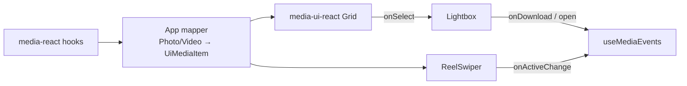

# UI Components

> **Status:** Planned specification for `media-ui-react` and `media-ui-native`. Not implemented yet.

## Headless philosophy

MediaForge UI packages are **genuinely headless**:

- They provide **behavior**, **state**, **accessibility**, and **prop getters**.
- They do **not** impose colors, typography, spacing systems, or CSS frameworks.
- The **application owns styling and presentation**.
- They do **not** depend on `media-core`, `media-react`, or `media-native`.
- They accept generic `UiMediaItem` (or equivalent) props; apps map SDK models → UI items.

If removing a border, shadow, background, or radius does not hurt interaction, the library must not require it.

---

## Package split

| Package | Platform | Components |
| --- | --- | --- |
| `media-ui-react` | React DOM | Grid, Lightbox, ReelSwiper |
| `media-ui-native` | React Native | Grid, Lightbox, ReelSwiper |

APIs should be conceptually mirrored; host elements differ (`div` vs `View`, etc.).

---

## Shared item contract

```ts
interface UiMediaItem {
  id: string;
  type: 'photo' | 'video';
  title?: string;
  alt?: string;
  previewUrl: string;
  width?: number;
  height?: number;
  duration?: number;
}
```

UI packages never fetch `previewUrl`; they only consume it when the app renders media inside render props.

---

## Grid

### Purpose

Present a collection of media items in a navigable, selectable grid. Used by the demo for Search → Grid → Lightbox.

### Planned responsibilities

- Track item list and optional highlighted/selected index.
- Provide keyboard navigation (arrow keys when focused).
- Call `onSelect(item, index)` on activation (click / Enter / Space).
- Expose prop getters for grid container and items.
- Support loading and empty flags as **state inputs** (not spinners with fixed styles).

### Planned non-responsibilities

- Masonry layout algorithms requiring fixed design opinions (optional later).
- Image lazy-loading libraries as hard dependencies (apps may wrap).
- Data fetching / pagination controls (app + SDK hooks).

### API sketch

See [API_CONTRACTS.md](./API_CONTRACTS.md) `GridProps`.

Preferred patterns (either or both):

1. **Render prop / `renderItem`** with `getItemProps()`.
2. **Headless hook** `useGrid({ items, onSelect })` returning `{ getGridProps, getItemProps, ... }`.

### Composition example (planned consumer pattern)

```tsx
const grid = useGrid({ items, onSelect: (item, i) => openLightbox(i) });

return (
  <div {...grid.getGridProps({ className: styles.grid })}>
    {items.map((item, index) => (
      <button key={item.id} {...grid.getItemProps({ index, className: styles.cell })}>
        
      </button>
    ))}
  </div>
);
```

---

## Lightbox

### Purpose

Modal focus experience for a single media item with next/prev among a list. Used after grid selection.

### Planned responsibilities

- Open/close controlled by the app (`open`, `onClose`).
- Maintain / sync `index` with `onIndexChange`.
- Focus trap while open; restore focus on close.
- Keyboard: `Escape` closes; arrow keys change index.
- Backdrop click closes (configurable later if needed).
- Prop getters for overlay, close, next, prev.
- `renderMedia(item)` so apps decide `` vs `<video>` and chrome.

### Planned non-responsibilities

- Fetching full-resolution assets beyond what props provide.
- Hard-coded dark translucent overlay styles (apps style via props/`className` merges).
- Download networking (emit callback only).

### Accessibility

- `role="dialog"` + `aria-modal="true"`.
- Labelled by title/alt when available.
- Focus moves to dialog on open.
- Cycle tab within dialog.

---

## Reel Swiper

### Purpose

Vertical (default) or horizontal swipe/scroll snapping through video-centric items—reel-style browsing for the video demo flow.

### Planned responsibilities

- Controlled `index` + `onIndexChange`.
- Active slide detection (intersection or scroll position).
- Keyboard next/prev for accessibility.
- `onActiveChange(item, index)` for view tracking hooks in the app.
- `renderSlide` with `getSlideProps` / active flag.
- Basic pointer / touch swipe on web; PanResponder or scroll-snap equivalent on native (implementation detail).

### Planned non-responsibilities

- Autoplay policies beyond exposing `isActive` (app starts/stops video).
- Forcing muted/autoplay attributes.
- Fetching the next page of videos (app uses SDK pagination).

### Accessibility

- Only the active slide should be in the tab order when practical.
- Announce slide changes via polite live region **optional** content slot owned by the app, or a minimal aria-live hook in the library without visual styling.

---

## Prop getters

Prop getters are the primary styling escape hatch.

Conventions:

| Rule | Detail |
| --- | --- |
| Spread-safe | Return DOM/RN-safe props |
| Merge | `getItemProps({ className, style, onClick })` merges user handlers (call both) |
| No style ownership | Library does not require `className` values |
| Behavior first | Include handlers, ARIA, roles, tabIndex |

Incorrect (forbidden pattern):

```tsx
// Library forces styles
<div className="mf-grid mf-grid--dark" style={{ display: 'grid', gap: 16 }} />
```

Correct:

```tsx
<div {...getGridProps({ className: appStyles.grid })} />
```

---

## Accessibility checklist (planned)

| Component | Requirements |
| --- | --- |
| Grid | Items activatable via keyboard; meaningful labels |
| Lightbox | Dialog semantics; focus trap; Escape; labelled |
| Reel | Keyboard navigation; non-active slides hidden from a11y tree when possible |

Automated a11y tests (axe / RN analogs) are recommended in [TESTING.md](./TESTING.md).

---

## Styling responsibilities

| Layer | Owns |
| --- | --- |
| `media-ui-*` | Behavior, ARIA, prop getters, optional unstyled structural wrappers if needed for a11y |
| `apps/web` | CSS, layout density, typography, motion, breakpoints, dark/light |
| Design system (app) | Buttons, icons, loading skeletons |

UI packages may ship **zero CSS files**, or only optional recipe docs—not required stylesheets.

---

## Composition with data layer



The UI never imports hooks from `media-react`.

---

## Native parity

`media-ui-native` should mirror:

- Component names
- Prop names
- Prop getter philosophy
- Controlled state patterns

Differences limited to platform primitives and gesture systems.

---

## Related documents

- [API_CONTRACTS.md](./API_CONTRACTS.md)
- [ARCHITECTURE.md](./ARCHITECTURE.md)
- [skills/using-components/SKILL.md](../skills/using-components/SKILL.md)
